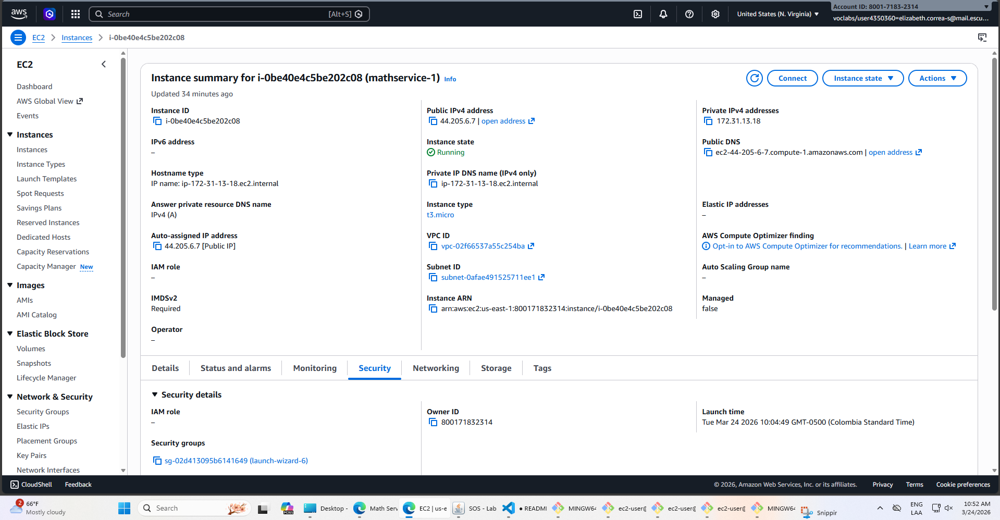
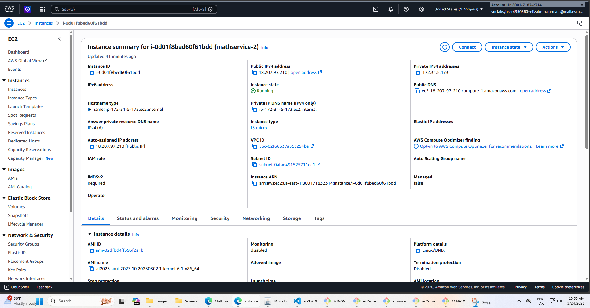
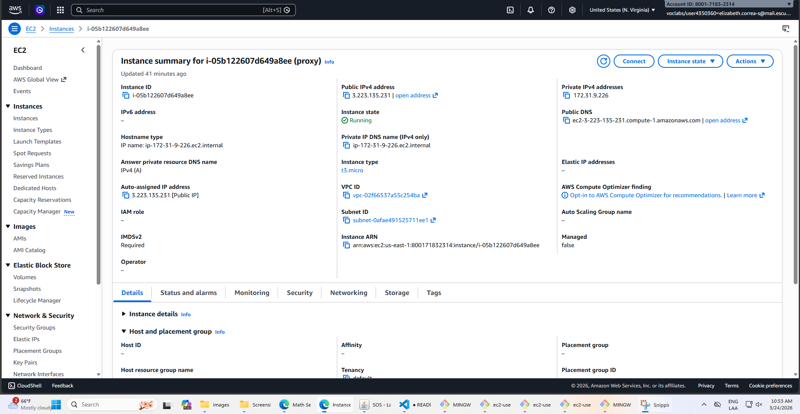
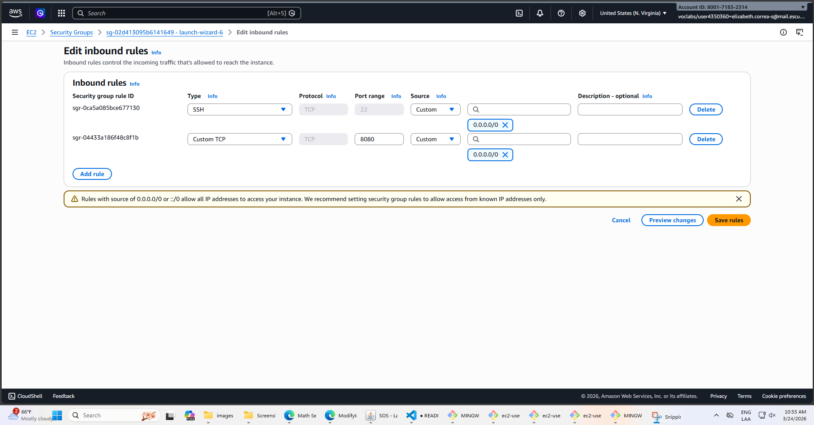
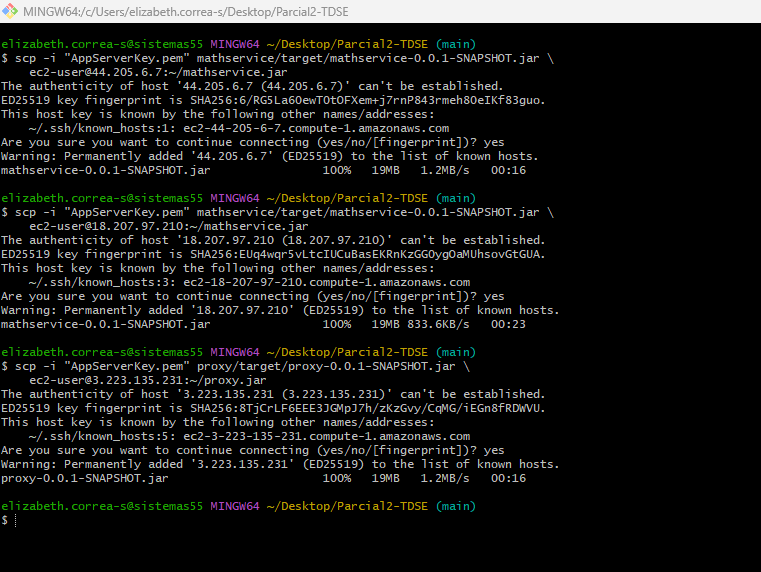
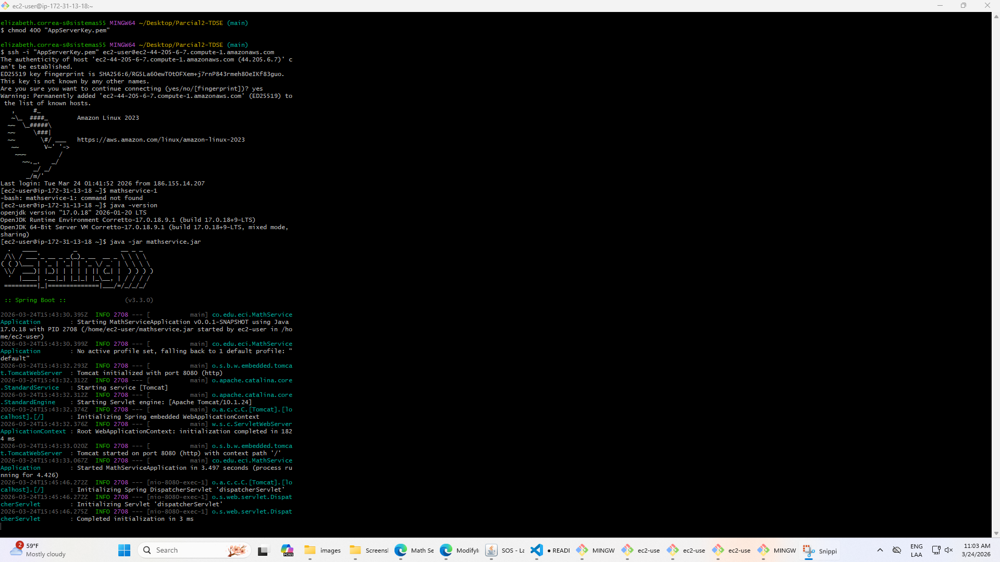
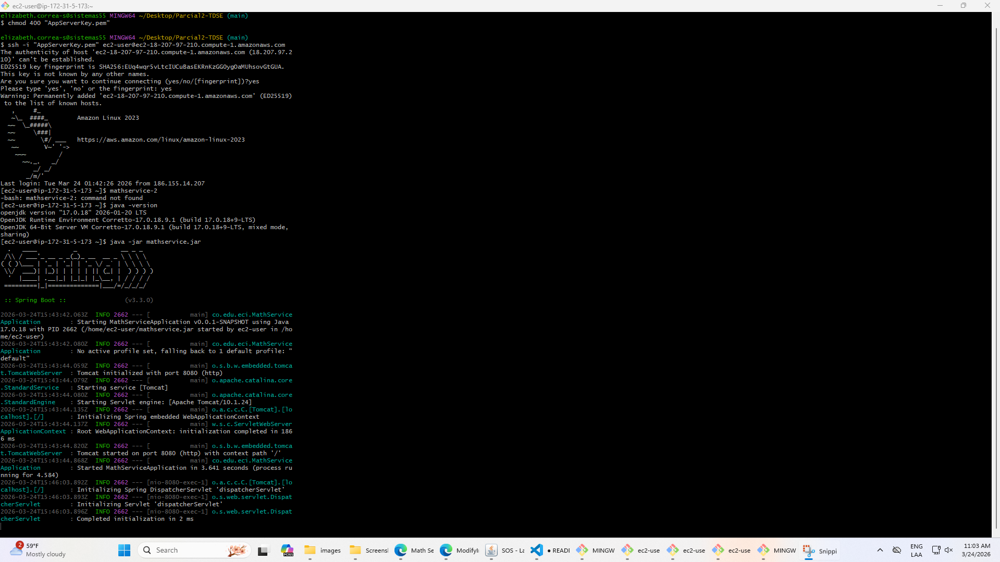
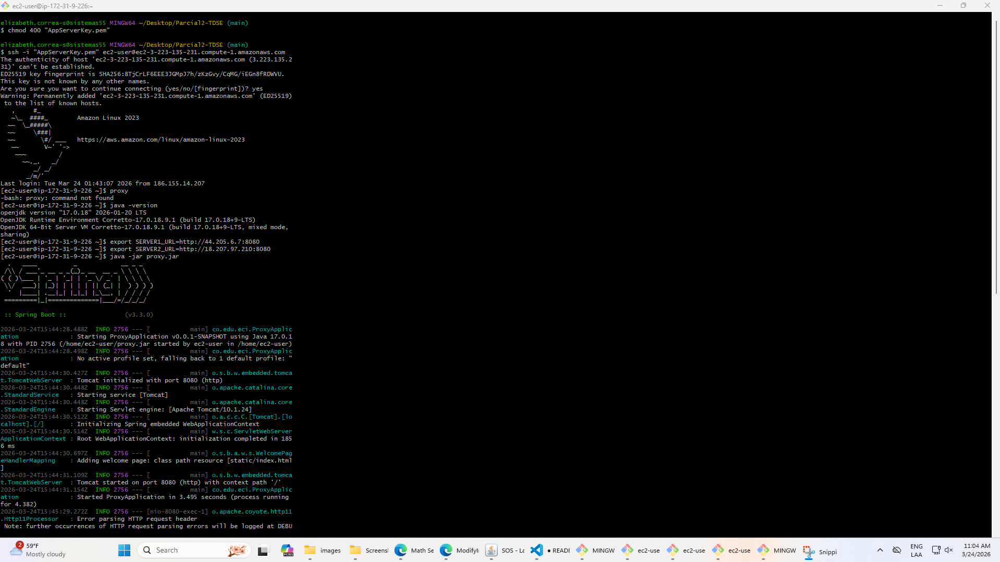
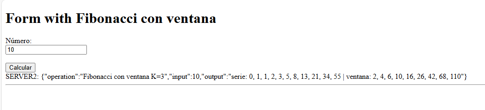
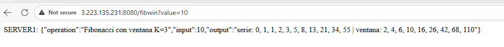

# Parcial2-TDSE

### Parcial segundo Tercio
### Elizabeth Correa Suarez

### Enunciado
Diseñe un prototipo de sistema de microservicios que tenga un servicio (En la figura se representa con el nombre Math Services) para computar las funciones numéricas.  El servicio de las funciones numéricas debe estar desplegado en al menos dos instancias virtuales de EC2. Adicionalmente, debe implementar un service proxy que reciba las solicitudes de llamado desde los clientes  y se las delegue a las dos instancias del servicio numérico usando un algoritmo de round-robin. El proxy deberá estar desplegado en otra máquina EC2. Asegúrese de poder configurar las direcciones y puertos de las instancias del servicio en el proxy usando variables de entorno del sistema operativo.  Finalmente, construya un cliente Web mínimo con un formulario que reciba el valor y de manera asíncrona invoke el servicio en el PROXY. Puede hacer un formulario para cada una de las funciones. El cliente debe ser escrito en HTML y JS.

### Arquitectura
Se tienen 3 instancias EC2: 2 para el mathservice y 1 para el proxy

### Evidencia instancias en aws

### Configuracion instancias
Para las 3 instancias se hizo la configuracion de puerto 8080 en los grupos de seguridad

### Despliegue
Para el despliegue en AWS, se instalo java 17 en cada instancia, y en el codigo local se genero el jar con  mvn clean package tanto para el mathservice como para el proxy, y luego se mando a cada instancia su correspondiente jar

### Ejecucion en las instancias

Primero para la parte del proximo no se pegaron las url directamente en el proxyController por buenas practicas, asi que en la instancia del proxy se usaron estos comandos:
 export SERVER1_URL=http://44.205.6.7:8080

 export SERVER2_URL=http://18.207.97.210:8080

Despues de esto con los comandos  java -jar mathservice.jar y java -jar proxy.jar se ejecutan en cada instancia

### ips instancias
instancia 1: 44.205.6.7 

instancia 2 : 18.207.97.210

instancia 3 3.223.135.231

### URLs

http://3.223.135.231:8080/index.html

http://3.223.135.231:8080/fibwin?value=10

### Algoritmo round-robin
Para mostrar el funcionamiento de este algoritmo se le agrego a la salida la parte de SERVER1 y SERVER 2 para mostrar directamente en el front con que servidor esta respondiendo cada vez que se recargue la pagina.

En el video a continuacion se evidencia el correcto funcionamiento de como intercambia en cada peticion a server1 o a server2

### video
[Ver video en Google Drive](https://drive.google.com/file/d/1solGALcZ0lAsQIOVW9dByaAhrTZXwN-_/view?usp=sharing)

